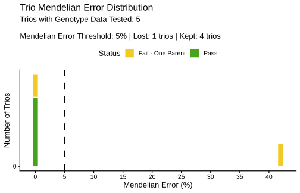
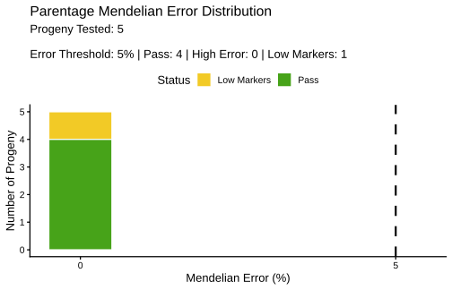

::: {.callout-note title="Source and verification"}
This page is adapted from Josue Chinchilla-Vargas's *BIGpopA Tutorial: Pedigree cleaning, validation, and parentage assignment from SNP genotype data*. The dataset, analysis sequence, function calls, and interpretations follow the supplied R Markdown and rendered HTML. Expected results were checked on July 16, 2026 with BIGpopA 1.0.5 from the official main branch at commit [`e98416e`](https://github.com/Breeding-Insight/BIGpopA/commit/e98416edde2d3f03b388955be695f2d502b6ce18).
:::

## What you will learn

This tutorial demonstrates a typical pedigree workflow using BIGpopA, the analytical engine behind [Familia](https://github.com/Breeding-Insight/Familia). You will run three functions in sequence:

1. `check_ped()` to detect and correct structural pedigree errors;
2. `validate_pedigree()` to test recorded parent-offspring trios against SNP genotypes; and
3. `find_parentage()` to search a supplied candidate-parent pool.

Before starting, read [Pedigree validation or parentage assignment?](pedigree-validation-vs-parentage-assignment.qmd) for the distinction between the two genotype-based tasks.

## What you need

- R 4.4.0 or newer;
- permission to install R packages; and
- an internet connection for installation from GitHub.

Code execution is disabled during normal site builds. The displayed results come from running Josue's complete example with R 4.5.1 and BIGpopA 1.0.5.

## 1. Install BIGpopA

The official BIGpopA repository currently describes the package as under development and provides a GitHub installation:

```r
install.packages("remotes")
remotes::install_github(
  "Breeding-Insight/BIGpopA",
  dependencies = TRUE
)

library(BIGpopA)
packageVersion("BIGpopA")
```

The verified version for this page is:

```text
[1] '1.0.5'
```

Report package problems through the [BIGpopA issue tracker](https://github.com/Breeding-Insight/BIGpopA/issues).

## 2. Create the example inputs

The example builds four objects directly in R:

| Object | Required content in this example |
|---|---|
| `genotypes` | One `id` column followed by SNP genotypes coded `0`, `1`, or `2`; `NA` represents missing data |
| `pedigree` | `id`, `male_parent`, and `female_parent` columns |
| `parents` | Candidate-parent `id` and sex coded `M` or `F` |
| `progeny` | IDs whose parentage will be searched |

Run the supplied example code:

```r
library(BIGpopA)

# SNP genotypes coded 0/1/2 (NA = missing); C_low is mostly missing
genotypes = data.frame(
  id    = c("M1","F1","M2","F2","C1","C2","C3","C_bad","C_low"),
  snp01 = c(  0,   0,   2,   2,   0,   2,   1,     0,     NA),
  snp02 = c(  0,   0,   2,   0,   0,   1,   0,     0,     NA),
  snp03 = c(  0,   2,   0,   2,   1,   1,   1,     1,     NA),
  snp04 = c(  0,   2,   0,   0,   1,   0,   0,     1,     NA),
  snp05 = c(  2,   0,   1,   1,   1,   1,   1,     1,     NA),
  snp06 = c(  2,   0,   1,   0,   1,   1,   1,     1,     NA),
  snp07 = c(  2,   2,   0,   1,   2,   0,   2,     2,     NA),
  snp08 = c(  2,   2,   2,   2,   2,   2,   2,     2,     NA),
  snp09 = c(  0,   1,   0,   2,   1,   1,   1,     1,      0),
  snp10 = c(  0,   1,   2,   0,   0,   1,   0,     0,      0),
  snp11 = c(  2,   1,   1,   2,   1,   2,   2,     1,      2),
  snp12 = c(  2,   1,   0,   1,   2,   1,   1,     2,      2),
  stringsAsFactors = FALSE
)

# Pedigree with founders coded 0, a misassigned trio (C_bad),
# and a duplicated row (C_missing)
pedigree = data.frame(
  id = c(
    "M1","F1","M2","F2","C1","C2","C3",
    "C_bad","C_low","C_missing","C_missing"
  ),
  male_parent = c(
    "0","0","0","0","M1","M2","M1",
    "M2","M1","M1","M1"
  ),
  female_parent = c(
    "0","0","0","0","F1","F2","F2",
    "F1","F1","F1","F1"
  ),
  stringsAsFactors = FALSE
)

# Candidate parents with sex and progeny to assign
parents = data.frame(
  id  = c("M1","M2","F1","F2"),
  sex = c("M", "M", "F", "F"),
  stringsAsFactors = FALSE
)

progeny = data.frame(
  id = c("C1","C2","C3","C_bad","C_low","C_missing"),
  stringsAsFactors = FALSE
)

pedigree
genotypes
```

The pedigree contains four founders, several crosses, a deliberately duplicated `C_missing` row, a misassigned `C_bad` trio, and a `C_low` sample with only four non-missing markers.

## 3. Clean the pedigree structure

`check_ped()` checks the columns `id`, `male_parent`, and `female_parent`. According to the BIGpopA documentation, exact duplicates and missing parent records are corrected automatically. Conflicting trios and inconsistent parent-sex roles are corrected by default. Cycles are reported for manual resolution.

```r
clean_ped_results = check_ped(
  pedigree,
  verbose = FALSE
)

clean_ped = clean_ped_results$corrected_pedigree
clean_ped
```

The repeated `C_missing` row is removed, leaving ten pedigree records:

| `id` | `male_parent` | `female_parent` |
|---|---|---|
| M1 | 0 | 0 |
| F1 | 0 | 0 |
| M2 | 0 | 0 |
| F2 | 0 | 0 |
| C1 | M1 | F1 |
| C2 | M2 | F2 |
| C3 | M1 | F2 |
| C_bad | M2 | F1 |
| C_low | M1 | F1 |
| C_missing | M1 | F1 |

Inspect individual issue tables when you need the records behind a correction:

```r
clean_ped_results$exact_duplicates
clean_ped_results$conflicting_trios
clean_ped_results$inconsistent_sex_roles
clean_ped_results$missing_parents
clean_ped_results$dependencies
```

## 4. Validate the recorded parents

`validate_pedigree()` compares each recorded trio with the genotype matrix and calculates a Mendelian-error percentage.

```r
ped_validate_results = validate_pedigree(
  clean_ped,
  genotypes,
  verbose = FALSE,
  plot_results = TRUE
)

ped_validate_report = ped_validate_results$full_results
ped_validate_report
```

{fig-alt="Histogram of Mendelian-error percentages for the example recorded trios. C1, C2, and C3 have zero percent error, while C_bad has 41.67 percent error and exceeds the five percent software default." fig-align="center"}

The verified result is:

::: {.table-responsive}
| `id` | Error (%) | Markers tested | `status` | `recommended_correction` |
|---|---:|---:|---|---|
| M1 | `NA` | 0 | `missing_both_parents` | `none` |
| F1 | `NA` | 0 | `missing_both_parents` | `none` |
| M2 | `NA` | 0 | `missing_both_parents` | `none` |
| F2 | `NA` | 0 | `missing_both_parents` | `none` |
| C1 | 0.00 | 12 | `pass` | `none` |
| C2 | 0.00 | 12 | `pass` | `none` |
| C3 | 0.00 | 12 | `pass` | `none` |
| C_bad | 41.67 | 12 | `fail` | `remove_male_parent` |
| C_low | 0.00 | 4 | `low_markers` | `low_markers_remove_female_parent` |
| C_missing | `NA` | 0 | `no_genotype_data` | `none` |
:::

The four founders appear as `missing_both_parents` in this run because no `founders_file` was supplied. For `C_bad`, the recorded male parent has an 83.33 percent homozygous-mismatch rate and the recorded female parent has zero percent, leading to `remove_male_parent`. `C_low` is not evaluated as a passing trio because only four markers are available.

The settings used above are the BIGpopA 1.0.5 defaults:

| Argument | Default | Function meaning |
|---|---:|---|
| `trio_error_threshold` | 5.0 | Maximum Mendelian-error percentage classified as `pass` |
| `min_markers` | 10 | Minimum non-missing markers required to evaluate a trio |
| `single_parent_error_threshold` | 2.0 | Maximum homozygous-marker mismatch percentage for a parent to be considered acceptable |

::: {.callout-important title="Defaults are not universal recommendations"}
These values document how BIGpopA 1.0.5 classified this supplied example. They are exposed as adjustable function arguments in the official package documentation.
:::

## 5. Assign parents from the candidate pool

When parentage is unknown, `find_parentage()` searches the supplied candidate parents. Josue's example uses `method = "best_pair"`.

```r
find_parentage_results = find_parentage(
  genotypes,
  parents,
  progeny,
  method = "best_pair",
  verbose = FALSE,
  plot_results = TRUE
)

find_parentage_report = find_parentage_results$full_results
find_parentage_report
```

{fig-alt="Histogram of Mendelian-error percentages for the best candidate-parent pairs. All five analyzed progeny have zero percent error, and C_low is marked low markers because only four markers were tested." fig-align="center"}

BIGpopA warns that `C_missing` is not in the genotype data and removes it from the parentage search:

```text
The following progeny IDs were not in the genotype file and will not be analyzed: C_missing
```

The verified report contains:

::: {.table-responsive}
| `id` | `male_parent` | `female_parent` | Error (%) | Markers tested | `status` |
|---|---|---|---:|---:|---|
| C1 | M1 | F1 | 0.00 | 12 | `pass` |
| C2 | M2 | F2 | 0.00 | 12 | `pass` |
| C3 | M1 | F2 | 0.00 | 12 | `pass` |
| C_bad | M1 | F1 | 0.00 | 12 | `pass` |
| C_low | M1 | F1 | 0.00 | 4 | `low_markers` |
:::

`C_bad` failed validation against its recorded pair of M2 and F1. In the candidate-parent search, the example recovers M1 and F1 with zero percent Mendelian error. `C_low` has the same best pair but remains `low_markers`.

The package documents four search methods:

| `method` | Search performed |
|---|---|
| `"best_pair"` | Best male and female parent pair |
| `"best_male_parent"` | Best male parent |
| `"best_female_parent"` | Best female parent |
| `"best_match"` | Best parent without using a parent-sex role |

Other documented controls include `error_threshold`, `min_markers`, `show_ties`, `allow_parent_selfing`, and `exclude_self_match`. Their defaults describe package behavior and should not be treated as dataset-independent recommendations.

## 6. Put the three steps together

The complete sequence from Josue's tutorial is:

```r
clean_ped = check_ped(pedigree)$corrected_pedigree

validated = validate_pedigree(
  clean_ped,
  genotypes
)$full_results

assigned = find_parentage(
  genotypes,
  parents,
  progeny,
  method = "best_pair"
)$full_results
```

Pedigree validation and parentage assignment answer different questions. The companion concept page explains how to read their outputs.

## 7. Record the software session

Record the versions used for an analysis:

```r
sessionInfo()
```

This page was verified with:

```text
R version 4.5.1
BIGpopA_1.0.5
```

## 8. Cite BIGpopA

Run the package citation command for the current reference:

```r
citation("BIGpopA")
```

For version 1.0.5, the installed package returns:

> Chinchilla-Vargas J, Sandercock A, University of Florida. 2026. *BIGpopA: Pedigree Validation Genetic Composition of Diploids & Polyploids*. R package version 1.0.5. <https://github.com/Breeding-Insight/BIGpopA>.

## Acknowledgments

Developed as part of [Breeding Insight](https://www.breedinginsight.org), an initiative providing open-source, data-driven tools for modern breeding programs.

## Continue learning

[Review validation and assignment](pedigree-validation-vs-parentage-assignment.qmd){.btn-bi-primary}
[Choose a genomic analysis path](genomics-path.qmd){.btn-bi-secondary}

## Sources

- Chinchilla-Vargas J. 2026. *BIGpopA Tutorial: Pedigree cleaning, validation, and parentage assignment from SNP genotype data*. Source R Markdown, R script, and rendered HTML supplied for adaptation to Software Hub.
- [BIGpopA 1.0.5 source and function documentation](https://github.com/Breeding-Insight/BIGpopA)
