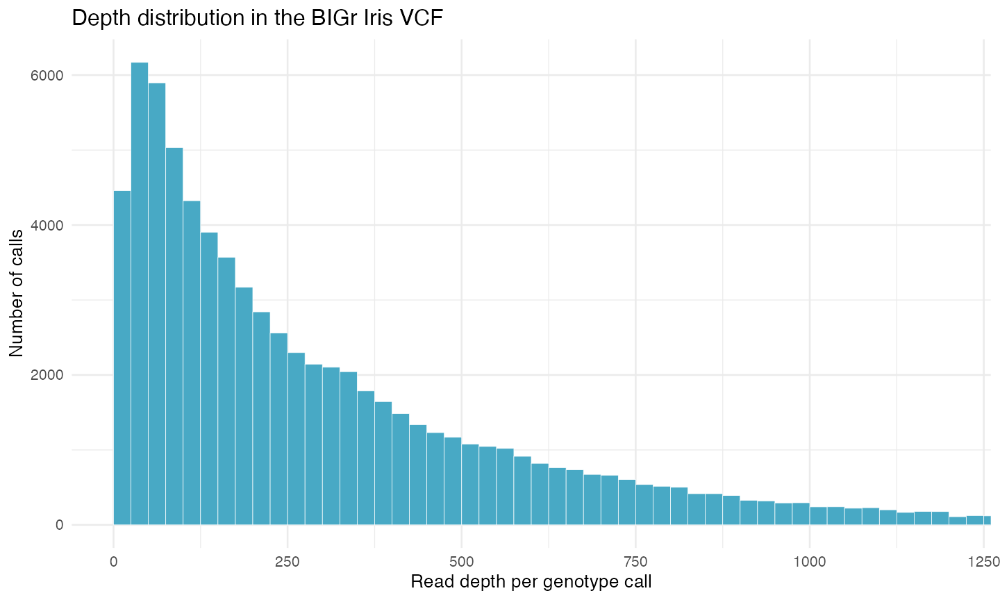

## What you will learn

In this tutorial you will use R and BIGr to load, inspect, filter, and visualize a Variant Call Format (VCF) file. Those core operations apply to genomic data from both **diploid and polyploid organisms**.

Ploidy becomes essential when you interpret genotype encoding and allele dosage, decide whether depth is sufficient to separate dosage classes, choose some filters, and prepare data for downstream analysis. The example Iris dataset was called as diploid, but each step identifies what stays the same and what must change for a polyploid dataset.

By the end, you will be able to:

1. install and verify R and the packages used in the tutorial;
2. load the VCF bundled with BIGr;
3. identify fixed, INFO, FORMAT, and sample fields;
4. extract genotype, dosage, depth, allele-depth, and probability values;
5. visualize depth and apply a documented filter; and
6. distinguish universal VCF operations from ploidy-aware interpretation.

## What you need

- A Windows, macOS, or Linux computer where you can install R packages;
- an internet connection for the initial setup; and
- about 30 minutes, plus package installation time.

::: {.callout-note title="About the displayed results"}
Code execution is disabled during normal site builds. The outputs and plot shown here were generated and checked with R 4.5.1, BIGr 0.8.1, and the VCF bundled with BIGr. Run each code block in your own R session to reproduce them.
:::

## 1. Install and verify R

BIGr requires **R 4.4.0 or newer**. R is the software that runs the analysis. Choose your operating system and follow the official CRAN instructions.

| Operating system | Official installer | What to choose |
|---|---|---|
| Windows | [Download R for Windows](https://cran.r-project.org/bin/windows/base/) | Download the current base installer and accept the standard options. |
| macOS | [Download R for macOS](https://cran.r-project.org/bin/macosx/) | Choose the installer that matches Apple silicon or Intel and your macOS version. |
| Linux | [R binaries for Linux](https://cran.r-project.org/bin/linux/) | Open the instructions for your distribution, such as Debian, Fedora, Red Hat, SUSE, or Ubuntu. |

When installation finishes, open R itself or a terminal and start R. At the `>` prompt, run:

```r
R.version.string
getRversion() >= "4.4.0"
```

The version text depends on the current R release and your operating system. The second command should return:

```text
[1] TRUE
```

::: {.callout-warning title="If the result is FALSE"}
Install a current R release from the CRAN link for your operating system, restart R, and run the check again. BIGr will not install on R versions older than 4.4.0.
:::

### Optionally install RStudio Desktop

RStudio Desktop is an editor that can make it easier to write scripts, run code, inspect objects, and view plots. It does not replace R and is not required for this tutorial.

If you want to use it, [download RStudio Desktop from Posit](https://posit.co/download/rstudio-desktop/) after installing R. Open RStudio and run the same version check in its **Console** pane:

```r
getRversion() >= "4.4.0"
```

The commands in this tutorial also work in the standard R console or in an R script run with `Rscript`.

### Check basic R commands

Run these commands one line at a time:

```r
2 + 2
mean(c(10, 12, 14))
```

Expected output:

```text
[1] 4
[1] 12
```

## 2. Install and load the packages

BIGr uses packages from both CRAN and Bioconductor. `BiocManager` configures those repositories and installs the required dependencies. This tutorial also uses `ggplot2` to make a plot.

```r
if (!requireNamespace("BiocManager", quietly = TRUE)) {
  install.packages("BiocManager")
}

BiocManager::install(
  c("BIGr", "ggplot2"),
  ask = FALSE,
  update = FALSE
)
```

Installation can take several minutes. You normally run the installation commands only once for each R library.

::: {.callout-tip title="Installation is different from loading"}
`BiocManager::install()` puts packages on your computer. `library(BIGr)` loads BIGr into the current R session. Load BIGr again whenever you start a new session and want to use it.
:::

Restart R, then load BIGr. The tutorial uses `vcfR`, a BIGr dependency, to read and extract VCF fields.

```r
library(BIGr)
```

Check that your versions meet the requirement and that the two supporting packages are available:

```r
stopifnot(getRversion() >= "4.4.0")
stopifnot(requireNamespace("vcfR", quietly = TRUE))
stopifnot(requireNamespace("ggplot2", quietly = TRUE))
```

No output means that all three checks passed. If a package check fails, restart R and repeat the installation block. Copy the complete error message if you need help; its final line may omit the dependency that failed.

## 3. Load the BIGr example VCF

`system.file()` locates a file installed inside an R package. This avoids hard-coding a path that would be different on every computer.

```r
vcf_file <- system.file(
  "iris_DArT_VCF.vcf.gz",
  package = "BIGr"
)

stopifnot(nzchar(vcf_file), file.exists(vcf_file))

iris_vcf <- vcfR::read.vcfR(
  vcf_file,
  verbose = FALSE
)

iris_vcf
```

Expected summary:

```text
***** Object of Class vcfR *****
150 samples
9 CHROMs
499 variants
Object size: 6.3 Mb
0 percent missing data
*****        *****         *****
```

::: {.callout-tip title="Checkpoint: the file loaded correctly"}
The object should report **499 variants**, **150 samples**, and **9 chromosomes**. If your numbers differ, confirm that `vcf_file` points to `iris_DArT_VCF.vcf.gz` from the installed BIGr package.
:::

## 4. Understand the VCF structure

A VCF has three main kinds of content:

| Part | What it contains | Examples in this file |
|---|---|---|
| Metadata | Definitions and provenance on lines beginning with `##` | File version and INFO/FORMAT definitions |
| Fixed columns | One description of each variant | `CHROM`, `POS`, `ID`, `REF`, `ALT`, `QUAL`, `FILTER`, `INFO` |
| Sample columns | One structured value per sample and variant | Genotype, dosage, depth, allele depths, probability |

Inspect the first six fixed records:

```r
fixed <- as.data.frame(iris_vcf@fix)

fixed[1:6, c(
  "CHROM", "POS", "ID", "REF", "ALT", "QUAL", "FILTER"
)]
```

Expected output:

```text
  CHROM POS         ID REF ALT QUAL FILTER
1  Chr1  10  Chr1_0010   A   B <NA>   <NA>
2  Chr1 100  Chr1_0100   A   B <NA>   <NA>
3  Chr4 810  Chr4_0810   A   B <NA>   <NA>
4  Chr4 820  Chr4_0820   A   B <NA>   <NA>
5  Chr4 830  Chr4_0830   A   B <NA>   <NA>
6  Chr4 840  Chr4_0840   A   B <NA>   <NA>
```

Now verify the dimensions, chromosomes, and per-sample FORMAT definition:

```r
n_variants <- nrow(iris_vcf@fix)
n_samples <- ncol(iris_vcf@gt) - 1
chromosomes <- sort(unique(iris_vcf@fix[, "CHROM"]))
format_fields <- unique(iris_vcf@gt[, "FORMAT"])

c(variants = n_variants, samples = n_samples)
chromosomes
format_fields
```

Expected output:

```text
variants  samples
     499      150

[1] "Chr1" "Chr2" "Chr3" "Chr4" "Chr5" "Chr6" "Chr7" "Chr8" "Chr9"

[1] "GT:UD:DP:RA:AD:MPP"
```

The order in `GT:UD:DP:RA:AD:MPP` tells you how to read every colon-separated sample value:

| Field | Meaning in this BIGr VCF |
|---|---|
| `GT` | Genotype expressed with reference allele index `0` and alternate allele index `1` |
| `UD` | Updog dosage count of the reference allele |
| `DP` | Read depth for the sample at the variant |
| `RA` | Number of reads assigned to the reference allele |
| `AD` | Comma-separated read counts for the reference and alternate alleles |
| `MPP` | Maximum posterior probability of the dosage call |

Do not assume that every VCF contains these fields or uses the same dosage convention. Read the `##FORMAT` definitions in each input file before interpreting its sample values.

## 5. Inspect genotypes, dosage, and depth

Extract each field into a matrix with variants in rows and samples in columns:

```r
gt <- vcfR::extract.gt(iris_vcf, element = "GT")
ud <- vcfR::extract.gt(
  iris_vcf,
  element = "UD",
  as.numeric = TRUE
)
dp <- vcfR::extract.gt(
  iris_vcf,
  element = "DP",
  as.numeric = TRUE
)
ra <- vcfR::extract.gt(
  iris_vcf,
  element = "RA",
  as.numeric = TRUE
)
ad <- vcfR::extract.gt(iris_vcf, element = "AD")
mpp <- vcfR::extract.gt(
  iris_vcf,
  element = "MPP",
  as.numeric = TRUE
)
```

Look at four sample calls for the first variant:

```r
first_calls <- data.frame(
  sample = colnames(gt)[1:4],
  GT = gt[1, 1:4],
  reference_dosage = ud[1, 1:4],
  depth = dp[1, 1:4],
  reference_reads = ra[1, 1:4],
  allelic_depths = ad[1, 1:4],
  posterior_probability = round(mpp[1, 1:4], 3),
  check.names = FALSE
)

rownames(first_calls) <- NULL

first_calls
```

Expected output:

```text
    sample  GT reference_dosage depth reference_reads allelic_depths posterior_probability
1 Sample_1 0/1                1   477             328        328,149                 1.000
2 Sample_2 0/1                1   583             170        170,413                 0.993
3 Sample_3 0/1                1   649             477        477,172                 1.000
4 Sample_4 0/1                1   506             142        142,364                 0.990
```

For this diploid example, `GT = 0/1` and `UD = 1` both describe one reference and one alternate allele. `UD` counts the reference allele, so `UD = 0` corresponds to the alternate homozygote and `UD = 2` to the reference homozygote.

Summarize all hard genotype calls and depths:

```r
table(gt)
summary(as.vector(dp))
```

Expected output:

```text
gt
  0/0   0/1   1/1
25676 43945  5229

   Min. 1st Qu.  Median    Mean 3rd Qu.    Max.
    0.0    86.0   208.0   315.6   438.0  3796.0
```

The file contains a hard genotype in every cell, but 1,481 cells have depth zero. A non-missing genotype string is not proof that the call has enough read evidence for your analysis. Inspect depth and probability together.

::: {.callout-important title="Ploidy checkpoint"}
**Universal VCF operations:** reading metadata, counting variants and samples, extracting `GT`, `DP`, `AD`, or other declared fields, locating missing or low-depth values, plotting quality distributions, and applying documented quality rules work for diploid and polyploid files.

**Ploidy-aware interpretation:** the valid number of allele copies, the meaning of genotype and dosage encoding, expected allele balance, sufficient sequencing depth, allele-frequency calculations, and downstream biological conclusions depend on the organism and caller's ploidy model.

For a biallelic locus at ploidy $P$, a dosage can span 0 through $P$. Adjacent expected allele fractions are separated by $1/P$, so higher-ploidy data generally need more read evidence to distinguish dosage classes reliably. Never reuse `ploidy = 2` merely because this Iris example uses it.
:::

## 6. Visualize read depth

A distribution plot can reveal low-depth calls and a long high-depth tail that a single mean would hide.

```r
depth_data <- data.frame(depth = as.vector(dp))

depth_plot <- ggplot2::ggplot(
  depth_data,
  ggplot2::aes(x = depth)
) +
  ggplot2::geom_histogram(
    binwidth = 25,
    boundary = 0,
    fill = "#48A9C5",
    color = "white",
    linewidth = 0.15
  ) +
  ggplot2::coord_cartesian(xlim = c(0, 1200)) +
  ggplot2::labs(
    x = "Read depth per genotype call",
    y = "Number of calls",
    title = "Depth distribution in the BIGr Iris VCF"
  ) +
  ggplot2::theme_minimal(base_size = 12)

depth_plot
```

{fig-alt="Histogram of read depth per genotype call in the BIGr Iris VCF."}

The display is limited to 0 through 1,200 so the main distribution is readable; the summary above confirms that some values extend to 3,796.

## 7. Filter with an explicit scientific rule

Start by evaluating a call-level depth rule without changing the VCF. A threshold of 20 is used here only to demonstrate the mechanics; it is not a universal recommendation.

```r
keep_depth <- dp >= 20

c(
  calls_passing = sum(keep_depth, na.rm = TRUE),
  percent_passing = round(
    mean(keep_depth, na.rm = TRUE) * 100,
    1
  )
)
```

Expected output:

```text
  calls_passing percent_passing
        71556.0            95.6
```

This logical matrix records which calls pass; it does not alter `iris_vcf`. Before setting a production threshold, examine the caller's probability estimates, depth distribution, technical validation, missing-data consequences, and whether adjacent dosage states can be separated at the organism's ploidy.

BIGr can also filter the full VCF. The example below removes variants with minor allele frequency below 0.05. The Iris file was modeled as diploid, so its correct argument is `ploidy = 2`.

```r
iris_filtered <- BIGr::filterVCF(
  iris_vcf,
  filter.MAF = 0.05,
  ploidy = 2
)

nrow(iris_filtered@fix)
```

Expected result after BIGr's progress messages:

```text
[1] 423
```

::: {.callout-warning title="Change ploidy for your data"}
For a tetraploid dataset, for example, use `ploidy = 4` only if tetraploidy matches the organism, genomic region, and genotype-calling model. Confirm whether dosage counts the reference or alternate allele before calculating frequencies or recoding values.
:::

## 8. Interpretation checkpoints

Before continuing to PCA, association analysis, genomic prediction, or another downstream task, record answers to these questions:

| Checkpoint | What to confirm |
|---|---|
| File identity | The intended samples, reference build, chromosomes, and variants are present. |
| FORMAT definitions | Every extracted field is defined in the header and interpreted using that definition. |
| Ploidy model | The organism or region's ploidy matches the genotype caller and BIGr arguments. |
| Dosage convention | The counted allele and valid range from 0 through $P$ are documented. |
| Depth and uncertainty | Thresholds are supported by the observed distribution and separate expected dosage classes adequately. |
| Filtering result | The number and identity of removed variants, samples, and calls are reviewed rather than accepted automatically. |
| Downstream encoding | The next method accepts the chosen genotype or dosage scale and preserves missingness appropriately. |

These checks matter for both diploids and polyploids. The difference is not whether quality control occurs, but which biological model gives each value meaning.

## Exercises

### Exercise 1: Count variants by chromosome

Use the fixed fields to count variants on each chromosome. Which chromosome contains the most variants?

<details>
<summary>Show solution</summary>

```r
sort(table(iris_vcf@fix[, "CHROM"]), decreasing = TRUE)
```

`Chr8` contains the most variants, with 163.

</details>

### Exercise 2: Check posterior probabilities

How many genotype calls have `MPP` below 0.90?

<details>
<summary>Show solution</summary>

```r
sum(mpp < 0.90, na.rm = TRUE)
```

The result is 844 calls. This count is a diagnostic, not an automatic recommendation to discard them.

</details>

### Exercise 3: Make the interpretation ploidy-aware

At a biallelic tetraploid locus, what are the possible alternate-allele dosages and idealized alternate-allele fractions?

<details>
<summary>Show solution</summary>

The possible dosages are 0, 1, 2, 3, and 4. Under equal sampling of both alleles, their idealized alternate-allele fractions are 0, 0.25, 0.50, 0.75, and 1. Observed read fractions vary around those expectations, so a dosage caller should model uncertainty rather than simply round the fraction.

</details>

## Summary and next steps

You used the same core operations needed for both diploid and polyploid VCFs: load the file, inspect its structure, extract declared fields, examine depth and uncertainty, visualize a quality distribution, and test a filtering rule. You also identified the ploidy-aware decisions that cannot be copied blindly: genotype and dosage encoding, expected allele fractions, sufficient depth, frequency calculations, and downstream interpretation.

Continue with the path that matches your goal:

- [What is allele dosage?](what-is-allele-dosage.qmd) explains dosage in diploids and polyploids.
- [Estimate copy number in alfalfa with Qploidy2](qploidy-alfalfa.qmd) points polyploid learners to the Qploidy2 workflow.
- [Explore Qploidy2](../software/qploidy2.qmd) describes tools for ploidy, aneuploidy, and copy-number estimation.
- [Process MADC genotype data](madc-to-vcf.qmd) continues into BIGr data preparation and VCF generation.
