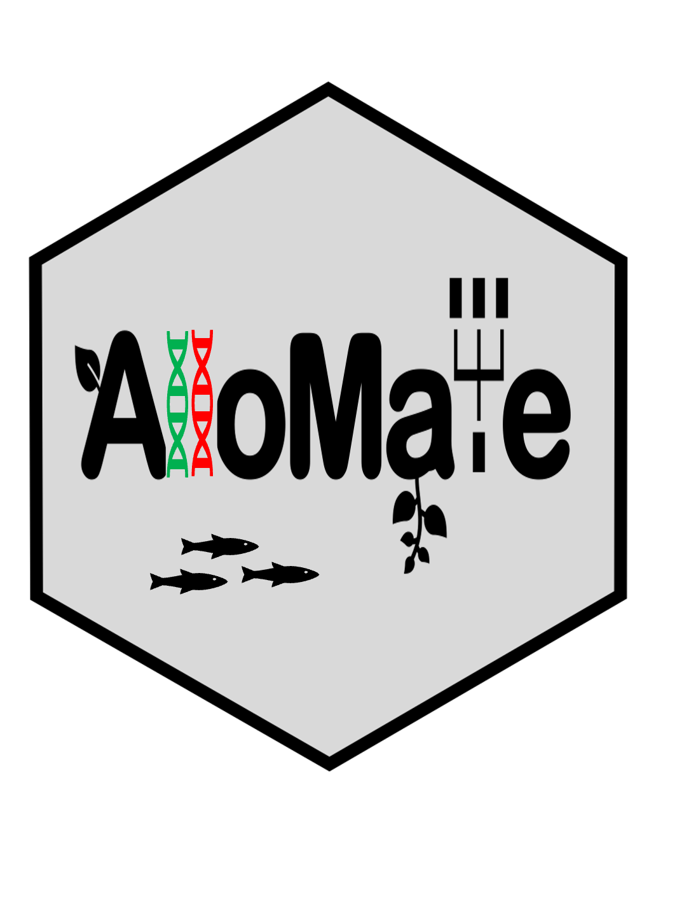

::: {.software-header}
::: {}
AlloMate is a Shiny application for evaluating kinship, combining estimated breeding values, optimizing individual contributions, and producing mating plans under relatedness constraints.

<div class="meta-row"><span class="pill">R Shiny</span><span class="pill">Mate allocation</span><span class="pill">OCS</span></div>
:::

:::

## Start here

```r
remotes::install_github("Breeding-Insight/AlloMate")
AlloMate::run_app()
```

[Source code](https://github.com/Breeding-Insight/AlloMate){.btn-bi-primary}
[Releases](https://github.com/Breeding-Insight/AlloMate/releases){.btn-bi-secondary}

## Good fit for

- Pedigree-based kinship analysis
- Multi-trait selection with weighted breeding values
- Optimum Contribution Selection and constrained mating plans

## Related learning

- [Choose a genomic analysis path](../learn/genomics-path.qmd)
