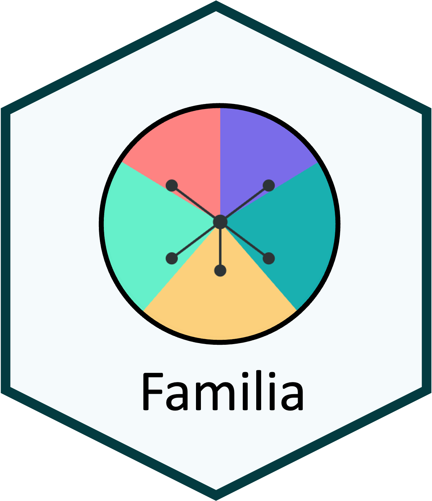

::: {.software-header}
::: {}
Familia is a Shiny application for validating pedigrees, assigning parentage, and assessing supervised or unsupervised ancestry in plant and animal breeding populations.

<div class="meta-row"><span class="pill">R Shiny</span><span class="pill">Pedigree</span><span class="pill">Ancestry</span></div>
:::

:::

## Start here

```r
remotes::install_github("Breeding-Insight/Familia")
Familia::run_app()
```

[Source code](https://github.com/Breeding-Insight/Familia){.btn-bi-primary}
[Releases](https://github.com/Breeding-Insight/Familia/releases){.btn-bi-secondary}

## Good fit for

- Pedigree cleaning and Mendelian error checks
- Parentage assignment from candidate parent pools
- Breed, line, and population ancestry assessment

## Related learning

- [Choose a genomic analysis path](../learn/genomics-path.qmd)
