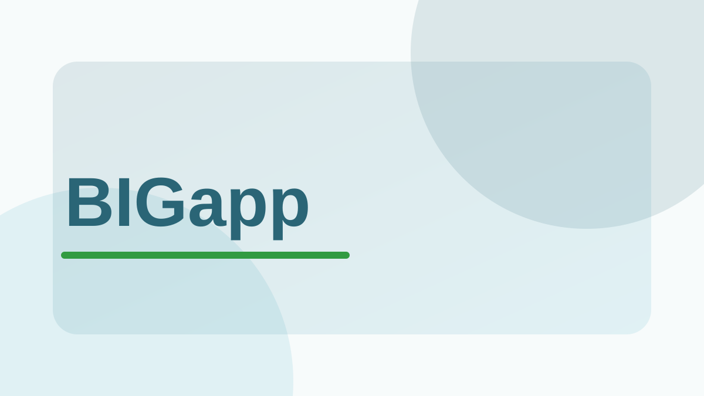

Use a workshop when you want a guided sequence of explanations and hands-on exercises. The example files are included so every participant can follow the same analysis.

## Available workshops

```{=html}
<div class="workshop-grid">
  <a class="workshop-card no-external" href="workshops/bigapp/">
    <div class="workshop-card-image">
      
    </div>
    <div class="workshop-card-body">
      <h3>Introduction to BIGapp for Plant Breeding</h3>
      <p>Import and filter genotype data, explore population structure, run GWASpoly, and try genomic prediction in a two-hour, point-and-click workshop. Local BIGapp installation is required.</p>
      <div class="meta-row" aria-label="Workshop details">
        <span class="pill">Workshop</span>
        <span class="pill">Beginner</span>
        <span class="pill">BIGapp</span>
        <span class="pill">2 hours</span>
      </div>
      <span class="workshop-card-link">Open workshop</span>
    </div>
  </a>
</div>
```

Looking for a shorter resource? Browse the [Learn library](learn.qmd) for focused concepts, guides, tutorials, and workflows.
