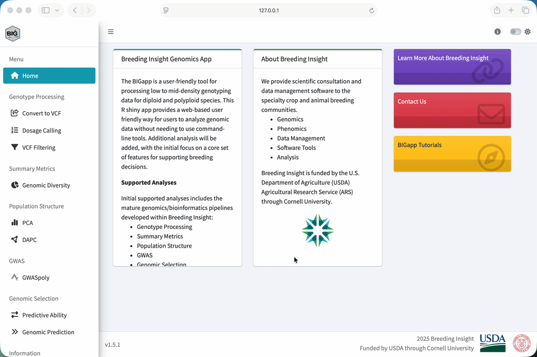
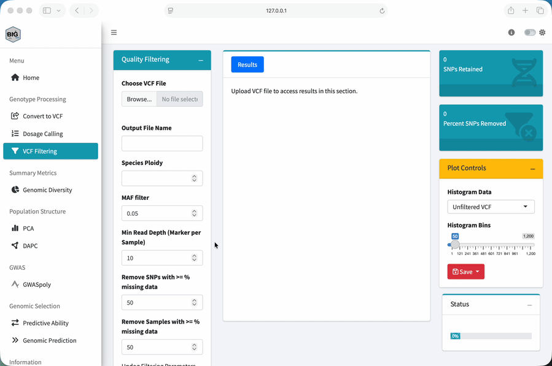
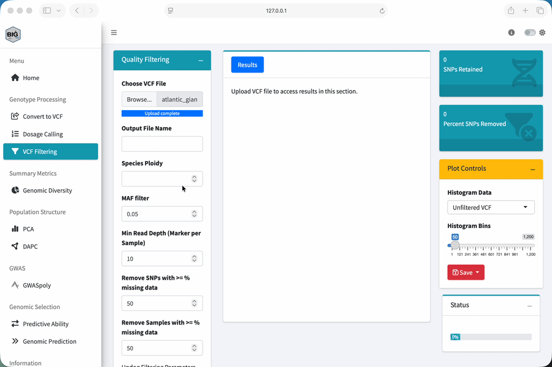
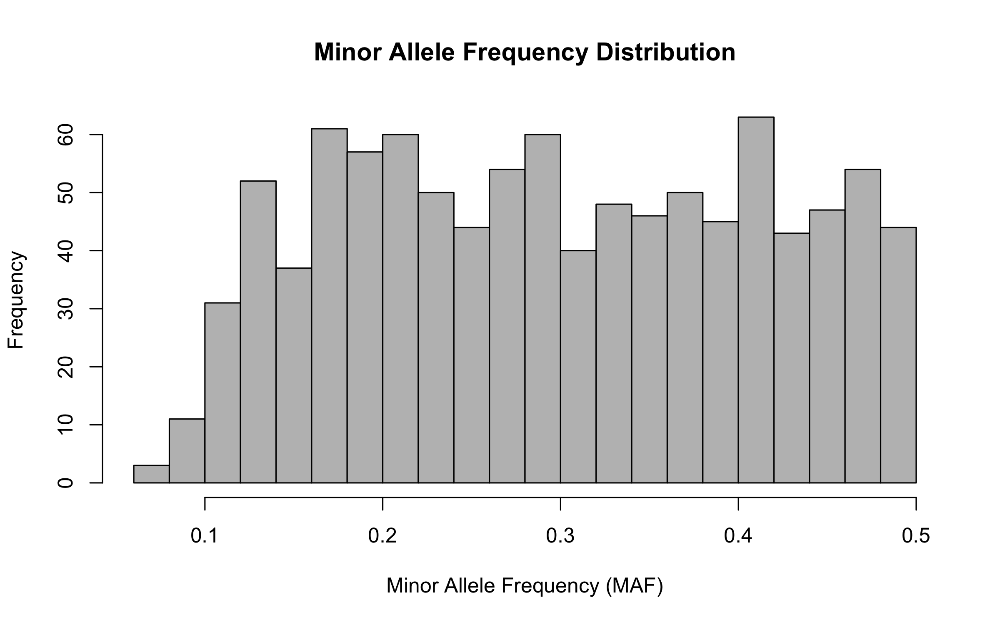

::: {.workshop-progress role="navigation" aria-label="Workshop progress"}
Workshop path

1. [Overview](index.qmd)
2. [Setup](setup.qmd)
3. [1. Quality control](data-quality-control.qmd){aria-current="page"}
4. [2. PCA](pca.qmd)
5. [3. GWASpoly](gwas.qmd)
6. [4. Genomic selection](genomic-selection.qmd)
7. [Dataset](dataset-guide.qmd)
:::

::: {.lesson-overview}
**Lesson at a glance**

- **Time:** 40 minutes
- **Start with:** local BIGapp and the original compressed VCF
- **Do:** inspect genotype fields and apply five filtering settings
- **Save:** the filtered VCF for every later module
:::

## Why Genomics in Plant Breeding?

Before we open BIGapp, let's step back and ask why we are using genomic data in the first place.

### The Traditional Breeding Challenge

Breeders cannot see genes directly. We make crosses, grow and evaluate plants, select the best individuals, and repeat that process across generations. That works, but it can be slow and expensive, especially when a trait takes years to measure, depends on a particular environment, or requires destructive phenotyping.

### What Genomic Data Gives Us

Genomic markers give us another way to compare individuals. We can use them to:

- identify which genetic variants each sample carries
- describe genetic relationships and population structure
- find genomic regions associated with measured traits
- support earlier selection when an appropriate prediction model has been validated

Genomic data does not replace careful phenotyping. It lets us connect phenotype records with inherited variation and make better-informed decisions.

::: {.callout-tip}
## The Bottom Line

Markers give us information we cannot get by looking at the plant alone. But that information is useful only if the genotype data are reliable enough for the analysis.
:::

## What is a SNP?

A single-nucleotide polymorphism, or SNP, is a genomic position where samples carry different bases. In a diploid biallelic marker, allele dosage records the number of alternate-allele copies:

| VCF genotype | Allele dosage | Interpretation |
|---|---:|---|
| `0/0` | 0 | two reference copies |
| `0/1` | 1 | one reference and one alternate copy |
| `1/1` | 2 | two alternate copies |

Polyploid dosage can range from zero to the species ploidy. See [What is allele dosage?](../../learn/what-is-allele-dosage.qmd) for a fuller explanation.

### From Genotypes to Dosage

The workshop VCF stores `GT`, `DP`, and `AD` for each sample-marker cell. `GT` is the genotype, `DP` is total read depth, and `AD` contains reference and alternate read counts. The [dataset guide](dataset-guide.qmd) documents every input.

In a VCF, the first columns identify the chromosome, position, marker, alleles, and other site-level information. The sample columns come next. The `FORMAT` column tells us how to read the colon-separated values in each sample cell. When `FORMAT` is `GT:DP:AD`, for example, each sample cell contains those three fields in that order.

## Find Your Way Around BIGapp

BIGapp organizes analyses in its left navigation. This workshop uses the current labels **VCF Filtering**, **PCA**, **GWASpoly**, **Predictive Ability**, and **Genomic Prediction**.

<figure>
  
  <figcaption>The navigation animation is supplementary. The current written labels above are the source of truth.</figcaption>
</figure>

## Loading Data

### What Data Do We Need?

This module starts with genotype data in a compressed VCF. Later modules will also use the phenotype CSV, which connects each `Sample_ID` with fruit weight and the metadata used to color plots.

At its simplest, the genotype data become a marker-by-sample dosage matrix:

| Sample | SNP 1 | SNP 2 | SNP 3 |
|---|---:|---:|---:|
| Sample 1 | 0 | 1 | 2 |
| Sample 2 | 1 | 1 | 0 |
| Sample 3 | 2 | 0 | 1 |

BIGapp converts the VCF genotype fields to this dosage representation for the analyses. We still need the original VCF because it also contains depth and allele-count information used for quality control.

### How Loading Works in BIGapp

Each analysis has its own upload controls. Uploading a file in one section does not make it available automatically in another section. We will upload the filtered VCF again when we move to PCA and GWASpoly.

<figure>
  
  <figcaption>BIGapp file-upload demonstration. Follow the numbered steps below if the interface has changed since this recording.</figcaption>
</figure>

When an analysis also needs the phenotype CSV, BIGapp opens **Trait File Options**. Select `NA` for **Missing Data Value**, choose `Sample_ID` for **Sample ID Column**, check the preview, and select **Save**. The preview is our chance to catch a wrong delimiter, shifted column, or unexpected sample-ID field before running the analysis.

## Quality Control: Why It Matters

Raw genomic data can contain uncertain genotype cells, poorly performing markers, and poorly performing samples:

- **Low-depth cells:** the genotype is supported by too few reads.
- **High-missingness markers:** a SNP is unavailable for an unusual fraction of samples.
- **High-missingness samples:** a sample has too little usable genotype information.
- **Very low-frequency markers:** there may be too little information for the intended analysis, or the calls may need closer inspection.

If we ignore these problems, every downstream result can be affected. So, we treat filtering as an analysis decision, not a cleanup button. We inspect the data before and after filtering, record every cutoff, and keep the original file.

## Why Filtering Order Matters

This order is important. BIGapp applies the minimum-depth rule to each genotype cell first. If a cell is below the cutoff, BIGapp sets it to missing. Only then does it calculate SNP and sample missingness.

That means raising the depth cutoff can also cause more markers or samples to cross a missingness threshold.

Minor allele frequency, or MAF, is then used to remove markers whose less common allele is below the chosen frequency. These settings are not universal recommendations. They are adjustable examples chosen for this simulated panel.

For more background, read [Choose a missing-data threshold](../../learn/choosing-missing-data-threshold.qmd). The maintained [SNP filtering for polyploid data](../../learn/snp-filtering-polyploids.qmd) also explains maximum-depth checks and why unusually deep markers can point to suspected paralogs or collapsed genomic regions.

## Filter the Workshop VCF

1. Start your local installation with `BIGapp::run_app()` and select **VCF Filtering** under **Genotype Processing**.
2. Under **Choose VCF File**, upload `atlantic_giant_pumpkin_diversity.vcf.gz`.
3. Set **Output File Name** to `atlantic_giant_pumpkin_filtered`.
4. Set **Species Ploidy** to `2`.
5. Set **MAF filter** to `0.05`.
6. Set **Min Read Depth (Marker per Sample)** to `10`.
7. Set **Remove SNPs with >= % missing data** to `50`.
8. Set **Remove Samples with >= % missing data** to `50`.
9. Leave **Use Updog Filtering Parameters?** off because this VCF does not contain the required updog quality annotations.
10. Select **Apply Filters** and wait until **Status** reaches 100 percent.
11. Use **Download VCF file** and keep the result for Modules 2 through 4.

<figure>
  
  <figcaption>VCF Filtering demonstration. The numbered settings above reflect the maintained interface.</figcaption>
</figure>

::: {.callout-important}
## These Are Example Thresholds

Ploidy 2 describes the simulated samples. Depth 10, MAF 0.05, and 50 percent missingness cutoffs were selected to expose the planted quality categories in this teaching dataset. Choose thresholds for real data from the assay, depth distribution, study goal, population, and downstream method.
:::

## Check Your Result

When the run finishes, BIGapp reports retained SNPs and the percentage removed. The downloaded VCF should contain:

| Check | Expected result |
|---|---:|
| Retained variants | 1,000 |
| Retained samples | 200 |
| Missing genotype cells | 9,447 |
| Variants removed | 200 of 1,200, or 16.7 percent |

## Summary Statistics

Use the **Plot Controls** panel to compare **Unfiltered VCF** and **Filtered VCF** histograms. Look at SNP missingness and sample missingness rather than relying only on the retained count.

{fig-alt="Histogram of marker minor allele frequencies after quality filtering" width="82%"}

For your own study, ask whether the retained distribution makes sense for the population and the way the markers were discovered. A skewed distribution is something to investigate. It is not an automatic instruction to tighten the cutoff.

### What Each Check Can Reveal

| Check | Question to ask |
|---|---|
| SNP missingness | Are some markers uncalled in an unusual fraction of samples? |
| Sample missingness | Are some samples consistently difficult to genotype? |
| Minor allele frequency | Are many markers nearly invariant in this dataset? |
| Read depth | Are calls supported by enough reads, and are unusually deep markers consistent with duplicated or collapsed regions? |

Maximum-depth and suspected-paralog checks are not part of this teaching filter, but they can matter for real sequence-derived markers. Review the maintained [SNP-filtering guidance](../../learn/snp-filtering-polyploids.qmd) before defining a research workflow.

### Optional: Genomic Diversity

For a broader summary, select **Genomic Diversity** under **Summary Metrics** and upload the filtered VCF. Set **Species Ploidy** to `2`, run the analysis, and review the **MAF Plot**, **OHet Plot**, **Sample Table**, and **SNP Table**.

The observed-heterozygosity plot can help us spot samples that are unusual relative to the rest of this dataset. An outlier is a reason to check identity, missingness, contamination, ancestry, and the expected biology. It is not an automatic reason to remove a sample.

## Exercise

Using the original workshop VCF and the settings above:

1. How many variants and samples remain?
2. What percentage of variants were removed?
3. How many genotype cells are missing after the depth rule is applied?
4. Which simulated marker categories account for the removed variants?
5. What changed between the unfiltered and filtered missingness plots?

::: {.callout-tip collapse="true"}
## Exercise Answer

The example retains 1,000 variants and all 200 samples. It removes 200 of 1,200 variants, or about 16.7 percent. Those are 100 simulated low-MAF markers and 100 simulated high-missingness markers.

Among the retained markers, 9,447 genotype cells are missing after cells below depth 10 are set to missing. If your result differs, first confirm the five numerical inputs and that you uploaded the original workshop VCF. A threshold typed as `0.50` in a field that requests a percentage is not the same as `50`.
:::

## Key Takeaways

- A depth rule changes individual genotype cells before marker and sample missingness are evaluated.
- Thresholds are dataset-specific analysis choices and must be reported.
- Counts alone are not enough; compare the distributions before and after filtering.
- Save the original VCF, filtered VCF, settings, and BIGapp version together.

## What to Save

Keep the downloaded filtered VCF with the two CSV inputs. BIGapp sections have separate file inputs, so you will upload the filtered VCF again in the next module.

::: {.workshop-next}
**Next:** Keep the filtered VCF, then continue to [Module 2: Population structure and PCA](pca.qmd).
:::
