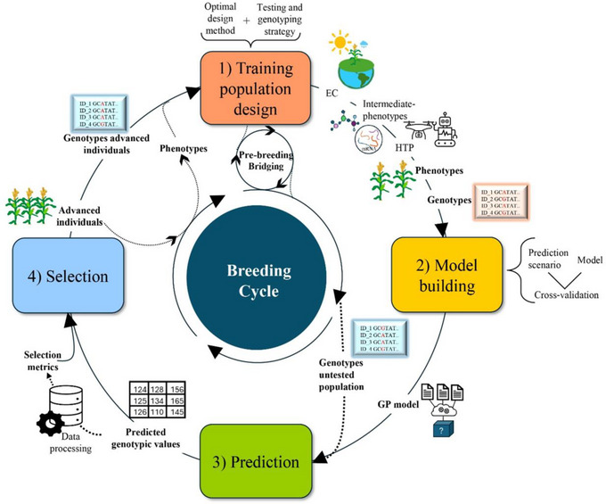
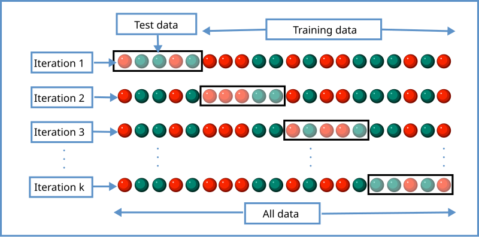
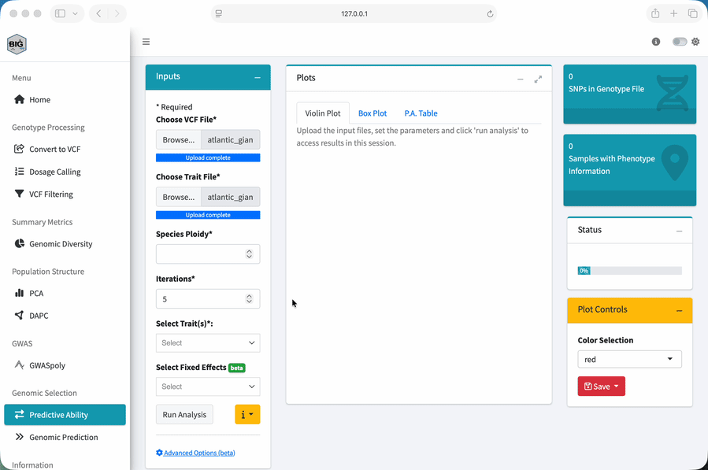

::: {.workshop-progress role="navigation" aria-label="Workshop progress"}
<span class="workshop-progress-title">Workshop path</span>

1. [Overview](index.qmd)
2. [Setup](setup.qmd)
3. [1. Quality control](data-quality-control.qmd)
4. [2. PCA](pca.qmd)
5. [3. GWASpoly](gwas.qmd)
6. [4. Genomic selection](genomic-selection.qmd){aria-current="page"}
7. [Dataset](dataset-guide.qmd)
:::

::: {.lesson-overview}
**Lesson at a glance**

- **Time:** optional self-study, about 30 minutes plus computation
- **Start with:** local BIGapp, the filtered VCF, and phenotype CSV
- **Do:** distinguish model evaluation from generation of predictions
- **Save:** validation results, predictions, settings, and sample definitions
:::

::: {.callout-note}
## Extra Material

This module is optional self-study. If there is time in the guided session, work through the concepts and **Predictive Ability** exercise. Otherwise, complete it after the workshop using your local BIGapp installation.
:::

## What is Genomic Selection?

Genomic selection uses markers across the genome to predict genetic merit for a trait. Unlike GWAS, we are not trying to interpret one significant locus at a time. We use information across many markers to predict candidates.

### The Traditional Problem

To evaluate a candidate as a parent, we may need to make crosses, grow offspring, measure the trait, and estimate breeding value from those records. For some traits and species, that can take years.

### The Genomic Approach

With genomic selection, we:

1. genotype the samples
2. train a model using samples with both genotypes and phenotypes
3. validate how well the model predicts held-out samples
4. use the fitted model to predict genotyped candidates

{fig-alt="Diagram showing a genomic-selection model trained with genotypes and phenotypes and then applied to genotyped candidates" width="80%"}

*Figure: Escamilla et al. (2025), [open-access article](https://pmc.ncbi.nlm.nih.gov/articles/PMC12127607/), licensed CC BY-NC-ND.*

::: {.callout-tip}
## The Key Insight

Once we have a validated model, we can generate predictions for genotyped candidates before collecting the target phenotype on every candidate. Those predictions supplement, rather than replace, the breeding program's field and experimental evidence.
:::

## How Does It Work?

### The Basic Idea

The training data contain both marker dosages and observed phenotypes. A genomic prediction model uses marker-based relationships and estimated effects to predict the trait or genetic merit of other genotyped samples.

The exact model is more complicated than adding a few known marker effects, but a useful mental model is:

```text
genotypes + phenotypes in the training set
                  |
                  v
           fitted prediction model
                  |
                  v
      predictions for genotyped candidates
```

### What We Need

| Component | What it contains | How it is used |
|---|---|---|
| Genotypes | Marker dosages for training samples and candidates | Builds genomic relationships and prediction inputs |
| Phenotypes | Trait records for training samples | Provides the response used to fit and validate the model |
| Training set | Samples with both genotypes and phenotypes | Fits the model |
| Target set | Samples for which we want predictions | Defines the actual prediction problem |

### What Affects Prediction?

Prediction depends on the data and the decision we want to make:

| Factor | Why it matters |
|---|---|
| Phenotype quality | No model can recover information that is not present in the trait records |
| Training-target relationship | Predictions usually transfer differently as the target becomes less represented by the training data |
| Trait architecture | Marker information can capture traits differently depending on the number and distribution of genetic effects |
| Environments and fixed effects | Training records and future candidates need comparable, correctly modeled context |
| Genotyping and marker overlap | Training and target data must use compatible markers, dosage coding, sample IDs, and ploidy |
| Validation design | The held-out samples need to represent the way predictions will actually be used |

There is no universal predictive-ability rating or minimum training-set size that applies to every breeding decision. We need to compare the model with the program's current selection process for the intended target samples.

## Running Genomic Selection in BIGapp

BIGapp separates model evaluation from the generation of predictions:

| BIGapp feature | Question it answers |
|---|---|
| **Predictive Ability** | How does the model perform on phenotypes withheld during cross-validation? |
| **Genomic Prediction** | What predicted phenotypes and EBVs does the fitted model return? |

::: {.callout-tip}
## Which Feature Should We Use?

Start with **Predictive Ability** to evaluate the model under a relevant validation design. Use **Genomic Prediction** to create predictions only after the inputs, intended target, and validation evidence have been defined.
:::

## Feature 1: Predictive Ability

### How Cross-Validation Works

BIGapp uses five-fold cross-validation. It splits the phenotyped samples into five groups, trains with four groups, predicts the fifth, and continues until every group has been held out. Predictive ability is the Pearson correlation between the observed and predicted values.

Repeating the five-fold split across iterations shows how much the result changes with fold assignment.

{fig-alt="Five rows of blocks illustrating five-fold cross-validation with a different test block held out in each row" width="80%"}

*Figure: [K-fold cross validation](https://commons.wikimedia.org/wiki/File:K-fold_cross_validation_EN.svg), Wikimedia Commons, CC BY-SA 4.0.*

The important part is not just the number of folds. The held-out samples should mimic the prediction problem we actually care about as closely as the available data allow. Read [Cross-validation accuracy for genomic prediction](../../learn/cross-validation-accuracy.qmd) before using this result in a breeding decision.

### Run Predictive Ability

1. Select **Predictive Ability** under **Genomic Selection**.
2. Under **Choose VCF File**, upload the filtered VCF from Module 1.
3. Under **Choose Trait File**, upload `atlantic_giant_pumpkin_diversity_phenotypes.csv`.
4. In **Trait File Options**, select `NA` and `Sample_ID`, review the preview, and select **Save**.
5. Set **Species Ploidy** to `2`.
6. Set **Iterations** to `5` for this short demonstration.
7. Under **Select Trait(s)**, choose `Fruit_Weight_lbs`.
8. Leave fixed effects and **Advanced Options (beta)** unchanged for the core exercise.
9. Select **Run Analysis**.

<figure>
  
  <figcaption>Genomic selection demonstration. The current application separates Predictive Ability from Genomic Prediction, as described in the written steps.</figcaption>
</figure>

### Understand the Output

- **Violin Plot:** shows the distribution and density of correlations across cross-validation results.
- **Box Plot:** summarizes the median, spread, and possible outliers.
- **P.A. Table:** records predictive ability for each iteration and selected trait.

Do not reduce this output to one fixed expected correlation. Values can change because fold assignment is random. Save the full distribution, iteration count, method, relationship matrix, and samples included.

## Feature 2: Genomic Prediction

### Two Ways to Use It

With the default single-VCF workflow, BIGapp fits the model using samples that have phenotypes and returns predictions for samples in that VCF. Under **Advanced Options (beta)**, a separate prediction VCF can be supplied for a distinct target set.

Before using a separate prediction VCF, check that the training and target files use compatible markers, allele coding, sample IDs, and ploidy.

### Run Genomic Prediction

1. Select **Genomic Prediction** under **Genomic Selection**.
2. Upload the same filtered VCF and phenotype CSV.
3. In **Trait File Options**, select `NA` and `Sample_ID`, then save.
4. Set **Species Ploidy** to `2`.
5. Under **Select Trait**, choose `Fruit_Weight_lbs`.
6. Leave fixed effects and **Advanced Options (beta)** unchanged for the core exercise.
7. Select **Run Analysis**, review the confirmation, and proceed.
8. Inspect **Predicted Pheno Table** and **EBVs Table**.
9. Use **Save Files** to retain the output and analysis settings.

### Understand the Output

The **Predicted Pheno Table** contains model predictions on the trait scale used for fitting. The **EBVs Table** contains model-based estimates of genetic merit under the selected settings.

An EBV is not an observed phenotype or a permanent property of the sample. It depends on the training data, model, trait definition, and target population. Check sample IDs, missing phenotypes, and the direction of selection before interpreting a ranking.

## Using the Results

Predictions can help us prioritize candidates, plan additional phenotyping, or compare possible parents. But a ranking is useful only if the validation represents how we plan to use the model.

Random folds can look better than the real prediction problem when close relatives occur in both training and test folds, or when future predictions target a different cycle, environment, or population.

Before making a decision, ask:

1. What future samples or breeding cycle should the validation mimic?
2. Could close relatives occur in both training and test folds?
3. Which fixed effects will be known when predictions are made?
4. What current selection process should the model be compared with?
5. What new phenotypes will be collected to monitor or update the model?

## Practical Considerations

### Training Data Design

The training set should represent the target material and trait range well enough for the intended decision. Accurate phenotypes, consistent sample identity, appropriate environmental information, and compatible genotypes all matter. Adding records is useful when those records add relevant information, not simply because the row count becomes larger.

### When Might Genomic Prediction Help?

It may be useful when phenotyping is expensive, slow, seasonal, destructive, or limited to later stages, and when the program can validate predictions for the candidates it needs to select.

It may add less value when the target trait is already easy and inexpensive to measure at the decision stage, the training records do not represent future candidates, or the validation design does not match deployment.

## Exercise

### Part 1: Assess Predictive Ability

1. Run **Predictive Ability** for `Fruit_Weight_lbs` with five iterations.
2. Compare the violin plot, box plot, and P.A. table.
3. How much do correlations vary across iterations?
4. What target population or future cycle does this validation represent?

### Part 2: Generate Predictions

1. Run **Genomic Prediction** for `Fruit_Weight_lbs`.
2. Confirm that **Predicted Pheno Table** and **EBVs Table** are available.
3. Compare the highest and lowest ranked samples.
4. Identify which information you would need before using that ranking in a real selection decision.

::: {.callout-tip collapse="true"}
## Exercise Answer

The Predictive Ability output contains a distribution of correlations rather than one guaranteed value. Record the values from your run because fold assignment is random.

Genomic Prediction returns a **Predicted Pheno Table** and an **EBVs Table** for `Fruit_Weight_lbs`. Numerical results depend on the fitted data and settings. The simulated regional pattern is part of the teaching dataset, not a recommendation to select samples from a particular region.

A defensible decision would also require a validation design that represents future candidates, reliable phenotypes, compatible genotype coding, the known fixed effects available at prediction time, and a comparison with the program's current selection process.
:::

## Key Takeaways

- Genomic selection uses genome-wide marker information to predict genetic merit.
- **Predictive Ability** evaluates held-out predictions under repeated five-fold cross-validation.
- **Genomic Prediction** creates predicted-phenotype and EBV tables from a fitted model.
- Validation should represent the samples and decisions for which the model will be used.
- There is no universal correlation rating or minimum training-set size for every program.
- Save the inputs, sample definitions, iterations, model settings, and complete output distribution.

## You Have Completed the Workshop

You have worked through the core BIGapp sequence:

1. **Data quality control:** filter uncertain genotype cells, markers, and samples.
2. **PCA:** explore genetic structure and possible outliers.
3. **GWASpoly:** find and diagnose marker-trait associations.
4. **Genomic selection:** evaluate prediction and generate model-based estimates.

From here, try the workflow with a carefully documented dataset from your own program, or return to the relevant module when you need to review an analysis decision.

## Resources

- [BIGapp repository and issue tracker](https://github.com/Breeding-Insight/BIGapp)
- [BIGapp tutorials](https://scribehow.com/page/BIGapp_Tutorials__FdLsY9ZxQsi6kgT9p-U2Zg)
- [Cross-validation accuracy for genomic prediction](../../learn/cross-validation-accuracy.qmd)

::: {.workshop-next}
**Finish:** Review the [dataset guide](dataset-guide.qmd), or return to the [workshop overview](index.qmd).
:::
