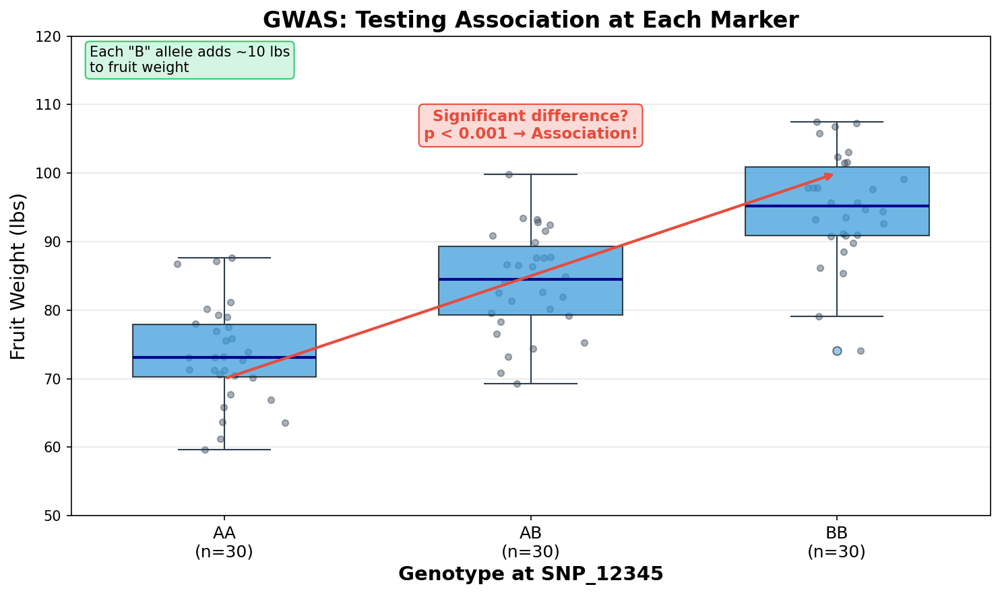
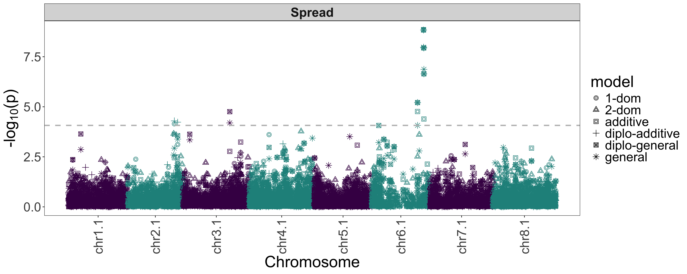
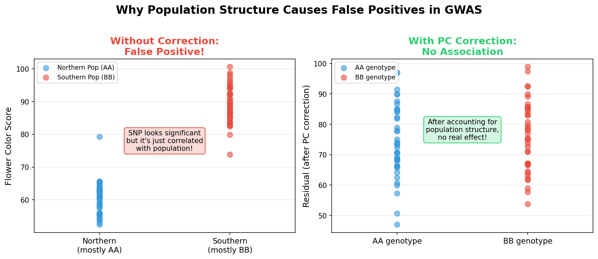
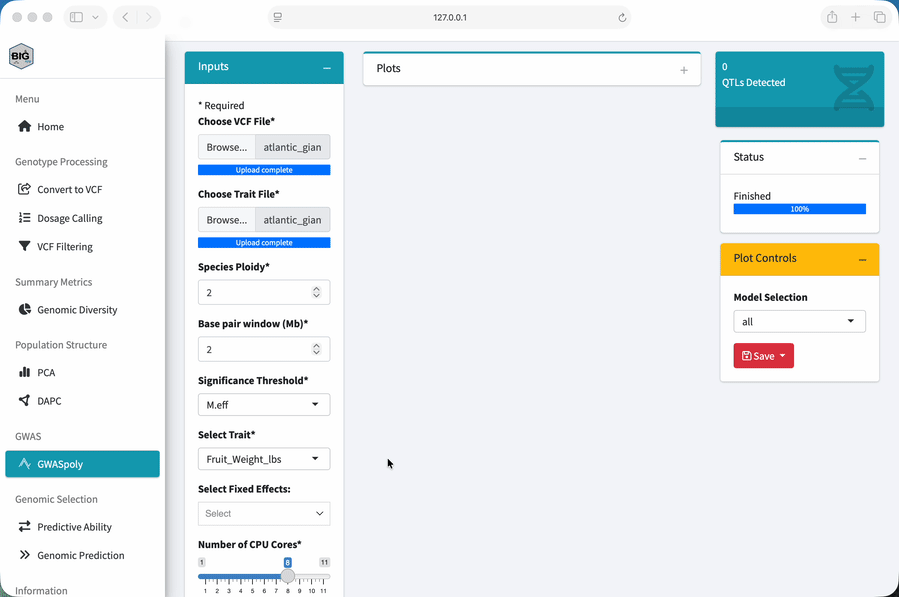
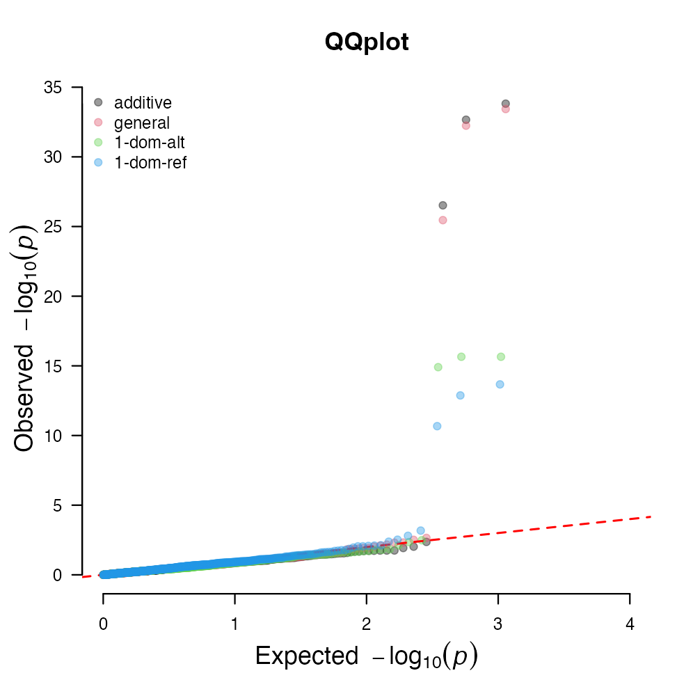

::: {.workshop-progress role="navigation" aria-label="Workshop progress"}
Workshop path

1. [Overview](index.qmd)
2. [Setup](setup.qmd)
3. [1. Quality control](data-quality-control.qmd)
4. [2. PCA](pca.qmd)
5. [3. GWASpoly](gwas.qmd){aria-current="page"}
6. [4. Genomic selection](genomic-selection.qmd)
7. [Dataset](dataset-guide.qmd)
:::

::: {.lesson-overview}
**Lesson at a glance**

- **Time:** 30 minutes
- **Start with:** the filtered VCF and phenotype CSV
- **Do:** run GWASpoly and review BIC, Manhattan, QQ, marker, and LD-window outputs
- **Save:** plots, result tables, model, threshold method, and window setting
:::

## What is GWAS?

A genome-wide association study, or GWAS, scans markers across the genome to find statistical associations with a measured trait.

### The Question GWAS Answers

> Which regions of the genome contain marker variation associated with this trait?

For a breeding program, we might ask:

- Which markers are associated with disease response?
- Where are genomic regions associated with yield?
- What marker variation is associated with flowering time or fruit quality?

A significant marker identifies an association in the analyzed samples and model. It does not by itself establish that the marker is causal.

### How It Works

At its simplest, GWAS does the same thing at every marker:

1. **Represent samples by genotype or allele dosage** at one marker.
2. **Compare phenotype information** associated with those genotype values.
3. **Fit a statistical test** for the marker effect under the selected model.
4. **Repeat the test** across markers throughout the genome.

{fig-alt="Boxplots compare fruit weight for AA, AB, and BB genotype groups, with increasing values used to illustrate a marker-trait association" width="80%"}

In this teaching figure, samples with more copies of the `B` allele tend to have greater fruit weight. That pattern makes the marker a candidate association.

The figure is intentionally simple. In the actual analysis, GWASpoly estimates dosage effects under the selected genetic model and accounts for the other model terms. It is not just comparing three unadjusted group means.

Because the analysis tests many markers, the significance method controls how evidence is judged under multiple testing.

## The Manhattan Plot

GWAS results are commonly summarized with a Manhattan plot. Each point represents one marker test.

{fig-alt="Manhattan plot with chromosomes along the horizontal axis and a group of significant markers forming a peak" width="72%"}

### Reading the Plot

- **Horizontal axis:** genomic position, arranged by chromosome
- **Vertical axis:** marker significance, usually negative log10 p-value
- **Peaks:** regions containing markers with comparatively strong evidence
- **Threshold line:** the cutoff produced by the selected significance method

Nearby tall points can represent correlated evidence from one genomic region rather than several independent trait loci. A peak is a region to investigate, not proof that its tallest marker is causal.

::: {.callout-tip}
## Why negative log10?

A p-value of 0.001 becomes 3 after the negative log10 transformation. Smaller p-values become larger plotted values, which makes genomic peaks easier to see.
:::

## Why Population Structure Matters for GWAS

Remember the PCA from Module 2? We saw that samples can differ in ancestry. That matters here because ancestry can be related to both marker frequencies and the phenotype.

### The Problem

Imagine that two ancestry groups differ in average fruit weight because of their breeding histories or environments. If the same groups also differ in allele frequency at a marker, the marker can appear associated with fruit weight even when it has no functional relationship with the trait. This is confounding: group membership helps explain both the marker and phenotype pattern.

{fig-alt="Two-panel diagram showing a marker-trait association caused by population structure and how adjustment can remove the apparent association" width="80%"}

### The Solution

We can include genetic relationships and principal components in the model to reduce this confounding. That does not guarantee that every false association disappears, so we still need to inspect the Manhattan and QQ plots.

BIGapp uses the GWASpoly random polygenic effect and a kinship matrix to account for genetic relationships. It also tests models that include the kinship matrix plus 1 to 10 principal components. BIGapp calculates the Bayesian Information Criterion, or BIC, for those models and uses the PC count with the lowest BIC.

We will check that result in the **BIC Plot** and **BIC Table**. Do not assume that the same number of PCs will be selected for every dataset.

## Running GWASpoly in BIGapp

### What You Need

This workshop uses a simulated diversity panel to demonstrate ancestry structure, marker-trait association, and linkage disequilibrium. Before starting, have these ready:

1. Your local BIGapp installation from the [required setup](setup.qmd)
2. The filtered VCF saved in Module 1
3. `atlantic_giant_pumpkin_diversity_phenotypes.csv`

The [dataset guide](dataset-guide.qmd) documents the simulation design and input fields.

### Run the Analysis

1. Select **GWASpoly** under **GWAS**.
2. Under **Choose VCF File**, upload the filtered VCF from Module 1.
3. Under **Choose Trait File**, upload `atlantic_giant_pumpkin_diversity_phenotypes.csv`.
4. In **Trait File Options**, use `NA` as the missing-data value, select `Sample_ID`, review the preview, and select **Save**.
5. Set **Species Ploidy** to `2`.
6. Set **Base pair window (Mb)** to `2` for the initial LD display.
7. Set **Significance Threshold** to `M.eff` for this exercise.
8. Under **Select Trait**, choose `Fruit_Weight_lbs`.
9. Leave **Select Fixed Effects** empty for the core exercise.
10. Keep **Number of CPU Cores** at `1` for the workshop exercise.
11. Select **Run Analysis** and wait until **Status** reports **Finished**.

<figure>
  
  <figcaption>GWASpoly demonstration. The animation is supplementary; use the current written controls and values above.</figcaption>
</figure>

BIGapp also offers `Bonferroni`, `FDR`, and `permute`. These methods handle multiple testing differently and can return different marker sets. We use `M.eff` here so everyone can compare the same workshop output. It is not a universal choice for every analysis. Check the [GWASpoly tutorial](https://jendelman.github.io/GWASpoly/GWASpoly.html) and the in-app parameter help before choosing a method for research data.

## Interpreting the Results

Do not judge the run from one plot. We will go through the outputs in an order that keeps the model choice, association evidence, and diagnostics connected.

### 1. Check the BIC Plot and Table

Open **BIC Plot** and **BIC Table**. Find the minimum BIC and record its number of PCs. This is the PC count BIGapp used for the run. The selected value is an output from this dataset, not a fixed recommendation for every analysis.

### 2. Check the Manhattan Plot and Significant Markers

Open **Manhattan Plot**. Under **Model Selection**, compare `all`, `additive`, `1-dom`, and `general` for this diploid exercise. Then open **QTL - significant markers** and sort the table by chromosome and position.

For each reported marker, connect the table back to the plot:

| Output | What it tells you |
|---|---|
| Chromosome and position | Where the marker occurs in the reference assembly |
| Model | Which dosage-effect model produced the result |
| P-value or plotted significance | Strength of evidence under that marker test |
| Threshold method | How the multiple-testing cutoff was defined |

### What Makes a Result Worth Following?

Look for a region that still makes sense after you check:

- the model and population-structure controls
- support from nearby markers
- genotype and phenotype data quality
- consistency in relevant environments or independent data
- whether the effect would matter for the breeding decision

### Red Flags

Stop and investigate if you see a single isolated marker, broad p-value inflation, a marker supported by very few samples, or a result that disappears with a reasonable model change.

### 3. Understand the Chromosome 4 Peak

The workshop data are designed to show three nearby significant markers on chromosome 4. Does that mean we found three independent trait loci?

In this example, no. This is linkage disequilibrium, or LD, in action. Nearby markers can carry correlated allele information.

| Marker | Position on chromosome 4 | Simulated role | Distance from `SNP_0240` |
|---|---:|---|---:|
| `SNP_0238` | 18,109,217 bp | LD tag | about 858 kb |
| `SNP_0239` | 18,487,979 bp | LD tag | about 479 kb |
| `SNP_0240` | 18,967,397 bp | causal ground truth | 0 kb |

::: {.callout-important}
## Key lesson

Several significant markers in one region can represent one candidate trait locus rather than several independent effects. We know `SNP_0240` is the causal ground truth because the [SNP-information file](dataset-guide.qmd#what-the-snp-information-csv-contains) records how the dataset was simulated. We could not make that claim from the GWAS result alone.
:::

Open **Filter QTL by LD window** and inspect the LD plot. Adjust **Adjust base pair window here to filter QTLs** while watching the **Filtered QTL** table. The LD curve helps you choose a physical base-pair window for grouping nearby hits. This control does not calculate pairwise LD clumps for every significant-marker pair.

With a window that groups the three chromosome 4 markers, we get one candidate QTL region. Record the distance you used and why you chose it.

In real data, the most significant marker can tag an unobserved causal variant. Fine mapping, functional annotation, independent validation, and biological evidence are needed before making a causal claim.

### 4. Check the QQ Plot

Open **QQ Plot**. A quantile-quantile plot compares observed p-values with the distribution expected under the null model.

{fig-alt="Quantile-quantile plot with most marker p-values close to a diagonal reference and several tail points departing" width="70%"}

Here is what to look for:

- **Most points near the diagonal:** the bulk of marker tests is broadly consistent with the reference distribution.
- **Departure mainly in the tail:** can be consistent with a limited set of associated markers.
- **Broad departure across the range:** can indicate unaccounted structure, model misspecification, or another systematic effect.

Do not diagnose the run from the most extreme point alone. Compare the QQ pattern with the BIC result, Manhattan plot, sample structure, and analysis settings.

### 5. Check the Multiple QTL Model

Open **Multiple QTL model** after the LD-window step. This output evaluates supported combinations of the candidate QTL retained after regional filtering. Save this table with the single-marker and LD-filtered results so the sequence of decisions remains reproducible.

## Dosage Models and Ploidy

GWASpoly models allele dosage rather than treating every marker as a simple presence or absence. The available genetic models describe different relationships between allele dosage and the trait. For this diploid workshop dataset:

| Model label | Interpretation for the exercise |
|---|---|
| `additive` | The expected effect changes with alternate-allele dosage |
| `1-dom` | Having at least one copy can be modeled as a dominant response |
| `general` | Genotype classes can differ without imposing an additive pattern |
| `all` | Display results from all fitted models together |

The **Species Ploidy** input determines the valid dosage range and the models available to the analysis. We use ploidy 2 because this workshop dataset is diploid. For your own data, use the biological ploidy and interpret only models that make sense for the study and genotype calls.

## From GWAS to Breeding

### What Can We Do With the Results?

After validation, a candidate region may support:

- development or evaluation of markers for selection
- investigation of genes and annotations near the associated region
- comparison of trait architecture across datasets or environments
- design of follow-up phenotyping, genotyping, or fine-mapping work

### Limitations

GWAS finds statistical associations under a defined sample and model. Its resolution depends on marker density and LD, and a significant marker may only tag the functional variant. Rare alleles and small effects can be difficult to detect, while structure, relatedness, phenotype quality, and technical artifacts can produce misleading patterns.

Before we use an association in a breeding decision, we should ask:

- Does it replicate in relevant breeding material and environments?
- Is the effect large enough to matter for the decision?
- Can we measure the intended allele or haplotype reliably with a deployable assay?

Report the analyzed samples, trait definition, genotype filtering, ploidy, genetic model, covariates, significance method, BIGapp version, and LD-window setting with the result.

## Exercise

Using `Fruit_Weight_lbs` and the settings in this module:

1. Record the number of PCs at the minimum BIC.
2. Identify the chromosome with the strongest association peak.
3. Record which model or models place markers above the selected threshold.
4. Examine the QQ plot. Is departure broad, or concentrated mainly in the tail?
5. Count the nearby significant markers in the chromosome 4 region.
6. Adjust the physical LD window. How does the number of retained candidate regions change?
7. Explain why several significant markers can represent one candidate QTL.

::: {.callout-tip collapse="true"}
## Exercise answer

The simulated data are designed to produce one chromosome 4 association region involving `SNP_0238`, `SNP_0239`, and `SNP_0240`. The markers span about 858 kb. A physical window that groups these nearby hits yields one candidate QTL region rather than three independent regions.

The QQ plot should be interpreted from your saved run rather than matched to a universal pattern. Your selected genetic model and significance method determine the exact significant-marker rows. `SNP_0240` is the simulated causal ground truth; the GWAS result alone would not establish that conclusion in observed data.

Save the BIC table, Manhattan plot, QQ plot, significant-marker table, LD-filtered table, multiple-QTL output, and the settings that produced them.
:::

## Key Takeaways

- GWAS tests association under a specific sample, trait, genotype set, and model.
- Manhattan plots show association evidence across genomic positions.
- Relationship information and PCs help reduce confounding from ancestry structure.
- BIC, Manhattan, marker-table, LD-window, QQ, and multiple-QTL outputs answer different questions.
- BIGapp uses an LD-informed physical window to group nearby significant markers.
- GWASpoly models allele dosage according to ploidy and the selected genetic model.
- Association is not causation. `SNP_0240` is known to be causal only because this dataset was simulated.

::: {.workshop-next}
**Next:** Continue to the optional [Module 4: Genomic selection](genomic-selection.qmd), or review the [dataset guide](dataset-guide.qmd).
:::
