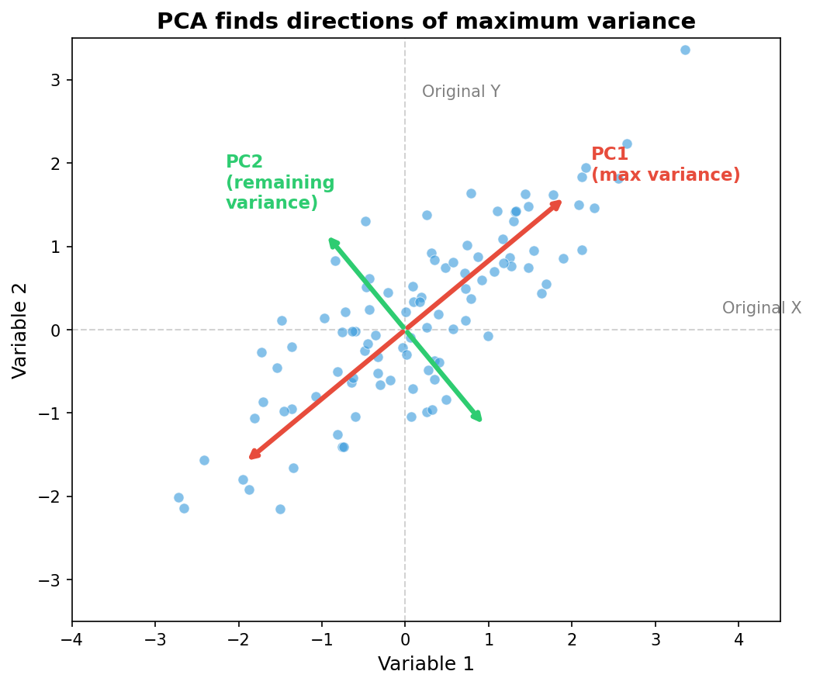
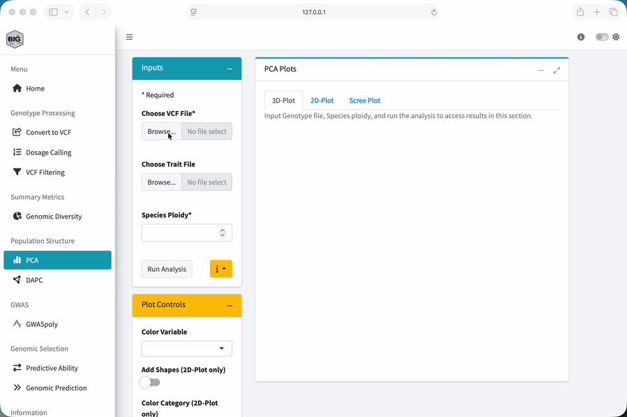
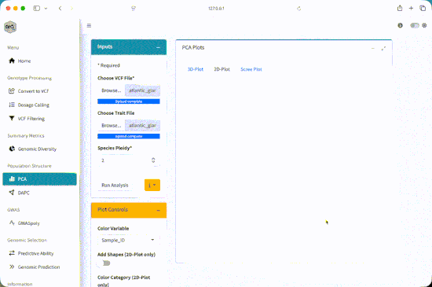
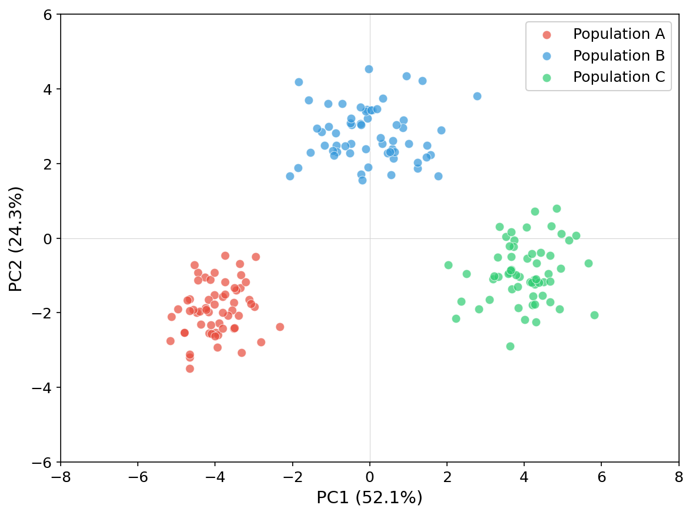
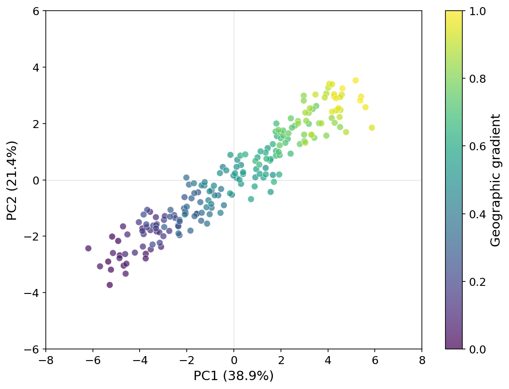
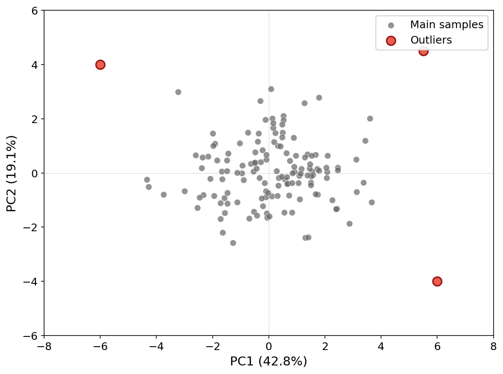

::: {.workshop-progress role="navigation" aria-label="Workshop progress"}
Workshop path

1. [Overview](index.qmd)
2. [Setup](setup.qmd)
3. [1. Quality control](data-quality-control.qmd)
4. [2. PCA](pca.qmd){aria-current="page"}
5. [3. GWASpoly](gwas.qmd)
6. [4. Genomic selection](genomic-selection.qmd)
7. [Dataset](dataset-guide.qmd)
:::

::: {.lesson-overview}
**Lesson at a glance**

- **Time:** 25 minutes
- **Start with:** the filtered VCF and phenotype CSV
- **Do:** run PCA, inspect variance, and compare plots with metadata
- **Save:** the PC table and a plot with the settings used
:::

Population structure means that some samples are more genetically similar to one another than to the rest of the dataset. Geography, breeding history, selection, gene flow, and relatedness can all create that pattern.

Why do we care? If we ignore structure, it can be confused with a marker-trait association. It can also affect how well a prediction transfers from one group to another.

## What PCA Does

Principal component analysis, or PCA, summarizes variation across many markers with a smaller set of axes. Each point in a PCA plot is a sample. Nearby points have more similar marker profiles than widely separated points, given the variants and scaling used in the analysis.

{fig-alt="Concept diagram in which principal component axes summarize a cloud of high-dimensional observations" width="78%"}

PCA is exploratory. A cluster does not prove that we found a biological population. An outlier is a reason to check the sample identity and data quality, not an automatic reason to delete the sample.

### Reading a PCA Plot

I like to read a PCA plot in three passes:

1. **Check the axes.** Which PCs are plotted, and how much marker variation does each represent?
2. **Look at the points.** Do you see separation, overlap, gradients, or isolated samples?
3. **Add the metadata.** Color or shape the points with trusted fields such as region, state, breeding program, plate, or sequencing batch.

This order reduces the temptation to force a biological story onto a pattern that could reflect data quality or a technical batch.

## Running PCA in BIGapp

1. Select **PCA** under **Population Structure**.
2. Under **Choose VCF File**, upload the filtered VCF from Module 1.
3. Under **Choose Trait File**, upload `atlantic_giant_pumpkin_diversity_phenotypes.csv`.
4. In **Trait File Options**, set **Missing Data Value** to `NA`, choose `Sample_ID` for **Sample ID Column**, review the preview, and select **Save**.
5. Set **Species Ploidy** to `2`.
6. Select **Run Analysis** and wait for the status to finish.
7. Review **3D-Plot**, **2D-Plot**, and **Scree Plot** under **PCA Plots**.
8. In **Plot Controls**, set **Color Variable** to `Region`.
9. Compare `Region` with `State` and `Breeding_Program`. Use **Add Shapes (2D-Plot only)** if an additional visual encoding helps.

<figure>
  
  <figcaption>Basic PCA demonstration. The current interface also requires the species ploidy input described above.</figcaption>
</figure>

## Reading the Output

The 2D and 3D plots show sample scores on selected components. The scree plot shows the variance summarized by successive components. Use the X-axis and Y-axis controls to inspect more than the first pair.

The scree plot is a summary, not a pass-fail test. A sharp decline means the early PCs capture relatively large directions of variation. A gradual decline means the variation is spread across more axes. Do not assume that only PC1 and PC2 matter just because they are shown first.

The workshop panel simulates three regional ancestry sources with gene flow. Color is therefore used to compare known simulated metadata with the genetic pattern, not to create the pattern.

<figure>
  
  <figcaption>Coloring PCA scores by a trait-file field. Select Region in the current Color Variable control.</figcaption>
</figure>

::: {.callout-tip collapse="true"}
## Exercise answer

The PCA should show three overlapping regional patterns rather than three perfectly separated groups. Eastern and Midwest samples overlap, while Western samples tend to be more separated. The overlap is expected because the simulated ancestry proportions include gene flow.

Exact variance percentages depend on the VCF you uploaded. Record the displayed values instead of comparing them with a generic expected range.
:::

## Practice Interpreting Patterns

{fig-alt="PCA scatterplot with several separated sample clusters" width="68%"}

Distinct groups can reflect population history, batches, related samples, or labeling problems. This is why we compare the plot with trusted metadata.

{fig-alt="PCA scatterplot with samples distributed along a continuous gradient" width="68%"}

Continuous variation can reflect admixture or geographic clines. It does not mean that structure is absent.

{fig-alt="PCA scatterplot with one sample separated from the main cloud" width="68%"}

If you see an outlier, check its sample identity, missingness, heterozygosity, ploidy, possible contamination, and whether it belongs to the intended taxon.

## Exercise

1. Which regional patterns overlap most?
2. Does coloring by `State` show finer variation within `Region`?
3. Are any apparent outliers also unusual in sequencing lane, plate, or missingness?
4. How does the plot change when you use PC2 and PC3?

::: {.callout-tip collapse="true"}
## Discussion answer

The planted regional structure should become clearer when colored by `Region`, but sample points remain admixed. Metadata associations are prompts for follow-up. They do not by themselves distinguish biology from technical batch effects.
:::

## Key Takeaways

- PCA summarizes marker variation; it does not assign biological populations by itself.
- Interpret the axes and point geometry before coloring by metadata.
- Compare biological labels with technical labels when investigating clusters or outliers.
- Save the PC scores and plotting choices so the display can be reproduced.

::: {.workshop-next}
**Next:** Download the PC table as an audit record, then continue to [Module 3: GWASpoly](gwas.qmd).
:::
