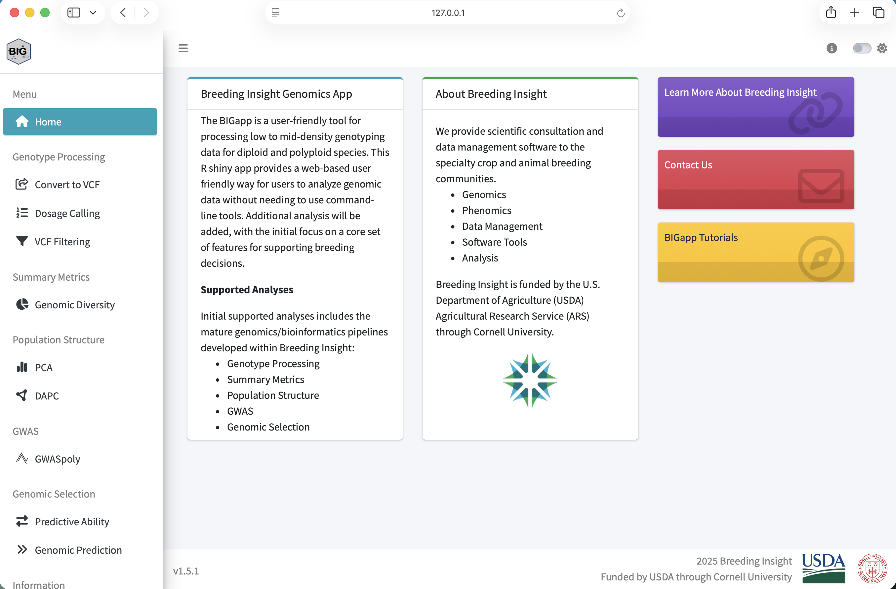

::: {.workshop-progress role="navigation" aria-label="Workshop progress"}
<span class="workshop-progress-title">Workshop path</span>

1. [Overview](index.qmd)
2. [Setup](setup.qmd){aria-current="page"}
3. [1. Quality control](data-quality-control.qmd)
4. [2. PCA](pca.qmd)
5. [3. GWASpoly](gwas.qmd)
6. [4. Genomic selection](genomic-selection.qmd)
7. [Dataset](dataset-guide.qmd)
:::

::: {.lesson-overview}
**Setup at a glance**

- **When:** complete before the guided session
- **Goal:** start BIGapp on your own computer
- **You need:** R 4.4.0 or later and internet access for installation
- **Pass condition:** the workshop VCF loads in local BIGapp
:::

We will run every workshop analysis in a local BIGapp installation. Installation can take time because BIGapp depends on several R and Bioconductor packages, so complete this page before the guided session.

## 1. Install R

Install R 4.4.0 or later from [the Comprehensive R Archive Network](https://cran.r-project.org/). After installation, open the R console or RStudio and check the version:

```r
R.version.string
```

If the reported version is older than 4.4.0, update R before continuing.

## 2. Install BIGapp

In a fresh R session, run the installation commands from the official BIGapp repository:

```r
if (!requireNamespace("BiocManager", quietly = TRUE)) {
  install.packages("BiocManager")
}
install.packages("remotes")

BiocManager::install(
  "Breeding-Insight/BIGapp",
  dependencies = TRUE
)
```

R will also install the required dependencies. If it asks whether to update old packages, review the prompt and follow the policy used for your computer or organization.

## 3. Start BIGapp locally

Run this command in R each time you want to start the application:

```r
BIGapp::run_app()
```

BIGapp opens in a web browser, but the R process on your computer is doing the analysis. Keep that R session running and leave the console window open.

When you are finished, return to the R console and press `Esc` in RStudio or `Ctrl+C` in a terminal.

Confirm that the left navigation includes **VCF Filtering**, **PCA**, **GWASpoly**, **Predictive Ability**, and **Genomic Prediction**.

{fig-alt="BIGapp home page showing the left navigation and welcome content" width="82%"}

::: {.callout-note}
## Online version is view-only

The [public BIGapp preview](https://big-demo.shinyapps.io/bigapp-main/) can be used to look at the interface before installation. It is not the workshop analysis environment. Run every upload, filter, PCA, GWASpoly, and genomic-selection exercise in your local installation.
:::

## 4. Download the example files

Save all three files in one folder. Do not extract the compressed VCF.

| Download | Expected contents |
|---|---|
| [Genotype VCF](data/atlantic_giant_pumpkin_diversity.vcf.gz){download="atlantic_giant_pumpkin_diversity.vcf.gz"} | 1,200 variants and 200 samples |
| [Phenotype CSV](data/atlantic_giant_pumpkin_diversity_phenotypes.csv){download="atlantic_giant_pumpkin_diversity_phenotypes.csv"} | 200 records plus a header |
| [SNP-information CSV](data/atlantic_giant_pumpkin_diversity_snp_info.csv){download="atlantic_giant_pumpkin_diversity_snp_info.csv"} | 1,200 records plus a header |

The [dataset guide](dataset-guide.qmd) provides checksums, field definitions, simulation details, and expected results.

## 5. Run the required preflight check

1. Start local BIGapp with `BIGapp::run_app()` if it is not already running.
2. In BIGapp, open **Genotype Processing** and select **VCF Filtering**.
3. Under **Choose VCF File**, browse to `atlantic_giant_pumpkin_diversity.vcf.gz`.
4. Wait for the upload progress indicator to finish.
5. Confirm that the file is accepted without a malformed-VCF message.

::: {.callout-tip collapse="true"}
## Preflight answer

The VCF upload completes and the **Quality Filtering** inputs remain available. You do not need to select **Apply Filters** yet. This confirms that the required local installation and teaching file are ready.
:::

## Troubleshooting

::: {.callout-warning collapse="true"}
## The upload fails

Confirm that the filename still ends in `.vcf.gz` and that your browser did not rename or extract it. Download the local copy again, restart BIGapp locally, and retry.
:::

::: {.callout-warning collapse="true"}
## Local installation fails

Restart R, record `R.version.string`, and retain the complete installation error. Search existing [BIGapp issues](https://github.com/Breeding-Insight/BIGapp/issues) before opening a new one. On macOS, compiled dependencies may also require the current Xcode command line tools.
:::

For maintained requirements and release instructions, consult the [official BIGapp README](https://github.com/Breeding-Insight/BIGapp#readme).

::: {.workshop-next}
**Next:** After the local preflight passes, continue to [Module 1: Data quality control](data-quality-control.qmd).
:::
